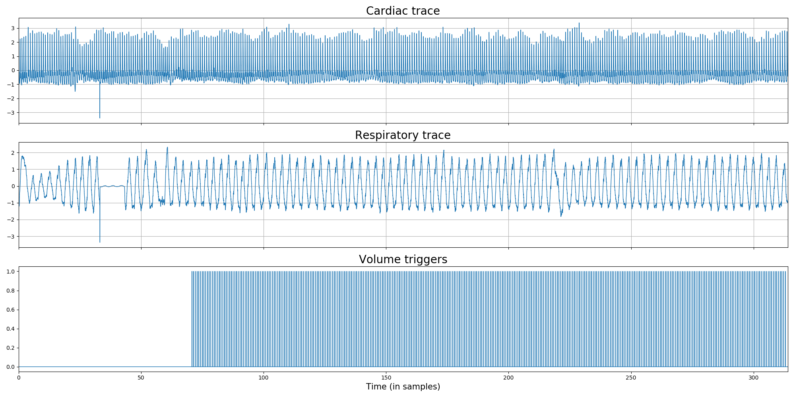

# scanphyslog2bids
[](https://travis-ci.org/lukassnoek/scanphyslog2bids)

Code to convert Philips physiology files ("SCANPHYSLOG") to the BIDS-format, including the estimation of volume triggers using the logged gradient, volume markers, or by interpolation. It writes out BIDSified physio-files (as `*.tsv.gz` and associated `*.json` files). From there on, you can use other software to, for example, estimate RETROICOR/HRV/RVT regressors for nuisance regression. I recommend using the [PhysIO toolbox](https://github.com/translationalneuromodeling/tapas/tree/master/PhysIO) for this (worked really well for me in the past).

## Installation
I recommend installing the package from the master branch using `pip`:

```
pip install https://github.com/lukassnoek/scanphyslog2bids/archive/master.zip
```

Or clone this repository locally and install as follows:

```
python setup.py install
```

This package depends on the following Python packages:
- nibabel
- numpy
- pandas
- matplotlib (optional for plots)
- click (for the CLI)

## Usage
This package comes with a Python interface and a CLI. See the code below for a minimal example using the Python interface:

```python
from scanphyslog2bids.core import PhilipsPhysioLog

log_file = 'my_scanphyslog_file.log'
out_dir = '~/my_bids_data'  # where the BIDSified data should be saved
deriv_dir '~/my_bids_data/physio'  # where some QC plots should be saved

# fmri_file is used to extract metadata, such as TR and number of volumes
fmri_file = 'fmri_file_associated_with_scanphyslog.nii.gz' 
fmri_img = nib.load(f)
n_dyns = fmri_img.shape[-1]
tr = np.round(fmri_img.header['pixdim'][4], 3)

# Create PhilipsPhysioLog object with info
phlog = PhilipsPhysioLog(f=log_file, tr=tr, n_dyns=ndyns, sf=496, manually_stopped=False)

# Load in data, do some preprocessing
phlog.load()

# Try to align physio data with scan data, using a particular method
# (either "vol_markers", "gradient_log", or "interpolation")
phlog.align(trigger_method='gradient_log')  # load and find vol triggers

# Write out BIDS files
phlog.to_bids(out_dir)  # writes out .tsv.gz and .json files

# Optional: plot some QC graphs for alignment and actual traces
phlog.plot_alignment(out_dir=deriv_dir)  # plots alignment with gradient
phlog.plot_traces(out_dir=deriv_dir)  # plots cardiac/resp traces
```

The command line interface can be used as follows:

```
(base) lukas@uva:~/software/scanphyslog2bids$ scanphyslog2bids --help
Usage: scanphyslog2bids [OPTIONS]

Options:
  --file TEXT           Scanphyslog file to convert
  --sf INTEGER          Sampling rate
  --fmri TEXT           Associated fmri file
  --ndyns INTEGER       Number of dynamics/volumes
  --tr FLOAT            Repetition time of fmri scan
  --manualstop          Was the scan manually stopped?
  --triggermethod TEXT  Method to detect triggers
  --outdir TEXT         Output directory for BIDS file
  --plottraces          Whether to plot the traces
  --plotalignment       Whether to plot the alignment
  --derivdir TEXT       Derivatives directory (for plots)
  --help                Show this message and exit.
```

## Output
Apart from the BIDSified SCANPHYSLOG files (i.e., a `*.tsv.gz` and `*.json` file), the package allows for creating plots of the physio-scan alignment (using the `plot_alignment` method or the `--plotalignment` flag) and the actual respiratory and cardiac traces (using the `plot_traces` method or the `--plottraces` flag).

The alignment plot looks similar to the figure below, which visualizes the full gradient trace (if available) with the estimated volume triggers on top (first row), the close-up view of the start and end of the trace (second/third row; because here most issues tend to arise during alignment), and a trace of the number of samples in between (estimated) volume triggers (fourth row). The number of samples in between triggers should generally not deviate more than 2 samples across triggers.


You can also use this plot to detect funky gradients.

The "traces" plot allow you to do some visual QC on the respiratory and cardiac traces:



## Advice
This package should work for different "types" of SCANPHYSLOG files, but ideally they contain volume markers (ask your Philips technician to enable this), so you're sure about the actual volume onsets. So, if possible, use the `vol_markers` "trigger method". If not, use the `gradient_log` method, which often works quite well, except for when your gradients are really funky (e.g., when you tilt the FOV a lot). For most scans, the "y" gradient direction works best to distill the volume onsets (use `which_grad='y'` when calling the `align` method). If you don't have volume markers *and* the gradients were not logged (this seems to happen at some scanners), you can use the `interpolate` trigger method. It works by "interpolating" triggers backwards from the end of the file, but this is definitely not foolproof, as the "end marker" in SCANPHYSLOG files do *not* seem to coincide with the actual offset of the last volume (the file is, as I've empirically estimated, about 166 samples *longer*). In the code, this assumed offset (default: 166) can be controlled with the `offset_end_scan` parameter.

Also, make sure you use the right sampling frequency (the `sf` parameter). The default is set to 496, which is the sampling frequency for *wireless* physio recorders. If you use a wired physio recorder, the sampling frequency is apparently 500 Hz.

## Issues
Feel free to submit an issue when encountering issues (of better yet: send a PR if you fixed the bug yourself).
